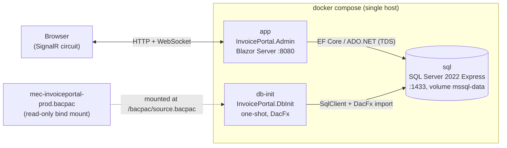
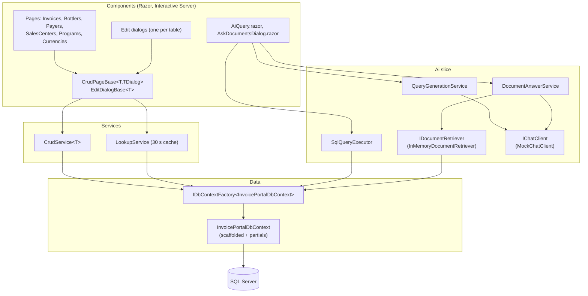

# Invoice Portal Admin: Architecture

This document describes the structure, data flows and integration points of the Invoice Portal Admin
proof of concept. It complements [README.md](README.md), which covers how to run the solution.

**One-paragraph summary.** A .NET 10 Blazor Web App (Interactive Server render mode, Radzen components)
administers a local copy of the Invoice Portal database. The database is SQL Server 2022 Express running in
Docker, populated once from a production bacpac by a one-shot console app. All data access goes through an
EF Core scaffolded model behind a `DbContext` factory. Two AI features, natural-language-to-SQL and grounded
document Q&A, are built on the `Microsoft.Extensions.AI` abstractions with every external model and index
replaced by an in-process mock. Nothing calls out to Azure or any other network service.

---

## 1. System context



Compose start-up ordering is enforced with health conditions: `db-init` waits for `sql` to pass its
`sqlcmd` health check, and `app` waits for `db-init` to exit successfully.

| Service   | Image / build                              | Role                                                             |
|-----------|--------------------------------------------|------------------------------------------------------------------|
| `sql`     | `mcr.microsoft.com/mssql/server:2022-latest`, `MSSQL_PID=Express` | Database engine. Data persists in the `mssql-data` volume. |
| `db-init` | `InvoicePortal.DbInit/Dockerfile`          | Sanitises and imports the bacpac if the database does not exist. |
| `app`     | `InvoicePortal.Admin/Dockerfile`           | The admin UI. HTTP only, port 8080.                              |

There is no authentication or authorization layer in the app. It is intended for a single developer on a
local machine.

---

## 2. Solution structure

```
InvoicePortal.slnx
├── InvoicePortal.DbInit/          console app: bacpac sanitiser + DacFx importer
├── InvoicePortal.Admin/           Blazor Web App
│   ├── Program.cs                 composition root (EntryPoint.Main)
│   ├── Components/                Razor UI: Layout, Pages (Invoices, Lookups, Ai), Shared bases
│   ├── Services/                  CrudService<T>, LookupService, EnumDisplay
│   ├── Data/                      EF Core scaffold (never hand-edited) + Partials + Enums + Abstractions
│   └── Ai/                        AI slice: options, DI, Chat (mock), Query (NL->SQL), Documents (RAG)
└── InvoicePortal.Admin.Tests/     xUnit tests for the AI slice, no database required
```

Key packages:

| Package                              | Version  | Used for                                             |
|--------------------------------------|----------|------------------------------------------------------|
| `Microsoft.EntityFrameworkCore.SqlServer` | 10.0.12 | Data access                                     |
| `Radzen.Blazor`                      | 11.4.0   | Grids, dialogs, forms, notifications                 |
| `Microsoft.Extensions.AI` (+ Abstractions) | 10.10.0 | `IChatClient` seam, logging decorator          |
| `Microsoft.SqlServer.DacFx`          | 170.5.76 | Bacpac import (DbInit only)                          |

---

## 3. Runtime architecture of the admin app

### 3.1 Layers



### 3.2 Dependency injection and lifetimes

Blazor Server keeps one DI scope per SignalR circuit, so "scoped" here means "per browser session".

| Registration                                   | Lifetime  | Notes                                                                                 |
|------------------------------------------------|-----------|---------------------------------------------------------------------------------------|
| `IDbContextFactory<InvoicePortalDbContext>`    | Singleton factory | Contexts are created per operation and disposed immediately. `EnableRetryOnFailure(3)`. |
| `CrudService<T>` (open generic)                | Scoped    | One per entity type per circuit.                                                      |
| `LookupService`                                | Scoped    | Dropdown sources cached per circuit for 30 seconds.                                   |
| `IChatClient`                                  | Singleton | `MockChatClient` wrapped with `.UseLogging()`.                                        |
| `IDocumentRetriever`                           | Singleton | Index built lazily on first use.                                                      |
| `SchemaDescriber`                              | Singleton | Schema text derived from EF model metadata, cached.                                   |
| `AiRateLimiter`                                | Scoped    | Fixed window, default 10 requests per minute per circuit.                             |
| `IQueryGenerationService`, `ISqlQueryExecutor`, `IDocumentAnswerService` | Scoped | Stateless orchestration.                          |
| Radzen `DialogService`, `NotificationService`  | Scoped    | Via `AddRadzenComponents()`.                                                          |

A factory is used instead of a scoped `DbContext` because a circuit can live for hours. A long-lived
tracked context would accumulate state and hold a connection open.

### 3.3 Shared CRUD behaviour

Every grid page inherits `CrudPageBase<TEntity, TDialog>` and every edit dialog inherits
`EditDialogBase<TEntity>`. Pages supply only the Radzen markup and a few overrides (`EntityName`, `KeyOf`,
`Shape` for `Include`s, `DialogWidth`). The bases provide server-side `LoadData`, Add/Edit through a
dialog, Delete with confirmation, Restore, the "Show deleted" toggle, and notifications.

---

## 4. Data model

The EF Core model is scaffolded from the local database and never edited by hand (the re-scaffold command
is in the README). Anything that must survive a re-scaffold lives in partial classes.

**Tables in the model** (nine of the many in the database):

| Table                    | Role in the UI                  | Soft delete | Audit columns |
|--------------------------|---------------------------------|-------------|---------------|
| `Invoices`               | Full CRUD, tabbed dialog        | `IsDeleted` (bit)          | yes |
| `Bottlers`               | CRUD (SAP-sourced ids)          | no          | yes |
| `Payers`                 | CRUD (SAP-sourced ids)          | no          | yes |
| `SalesCenters`           | CRUD (SAP-sourced ids)          | no          | yes |
| `Programs`               | CRUD                            | `IsDeleted` (nullable bit) | yes |
| `Currencies`             | CRUD                            | no          | yes |
| `Companies`, `Countries`, `BrandSegmentCategories` | Dropdown sources only | no | yes |

**Domain hierarchy**: Bottler (the "customer") owns Payers; Payer owns Sales Centers; Programs belong to a
Bottler. An Invoice references all of these plus Currency, Company and Country, and may point at a previous
revision of itself (`RevisedInvoiceId`). `Invoices.UserId` is a required foreign key to `AspNetUsers`, a
table this app does not manage. New invoices therefore default to the submitter of a recent invoice.

**Partial-class pattern.** `Data/Entities/Partials/*.cs` add `[NotMapped]` members to scaffolded entities:

- Marker interfaces `ISoftDeletable` and `IAuditable` (in `Data/Abstractions`) so `CrudService<T>` can
  treat soft delete and `UpdatedAt` stamping generically.
- Typed enum views over `int` columns, for example `Invoice.Status` over `Invoice.InvoiceStatus`, using enums
  copied from the Invoice Portal backend (`Data/Enums`).
- `DisplayName` helpers for dialogs and confirmations.

`SoftDelete.NotDeleted<T>()` builds the filter expression against the real mapped `IsDeleted` column
(handling both `bit` and nullable `bit`) so EF can translate it to SQL.

---

## 5. Data flows

### 5.1 Database provisioning (db-init, runs once)

```mermaid
sequenceDiagram
    participant C as docker compose
    participant I as db-init
    participant S as SQL Server (master)
    participant F as sanitised bacpac (temp)

    C->>I: start (after sql healthy)
    I->>I: check /proc/meminfo >= 2 GB
    I->>I: check BACPAC_PATH exists
    loop up to 3 min
        I->>S: SELECT 1
    end
    I->>S: SELECT DB_ID(@name)
    alt database exists
        I-->>C: exit 0 (nothing to do)
    else
        I->>F: BacpacSanitizer.Create(source, temp)
        Note over F: remove SqlUser, SqlRoleMembership,<br/>SqlPermissionStatement, SqlDatabaseCredential,<br/>SqlMasterKey from model.xml;<br/>IsEncryptionOn=False; rewrite SHA-256 in Origin.xml
        I->>S: DacServices.ImportBacpac(temp, DB_NAME)
        alt import fails
            I->>S: ALTER DATABASE SET SINGLE_USER; DROP DATABASE
            I-->>C: exit 1
        else
            I-->>C: exit 0
        end
        I->>F: delete temp file
    end
```

The original bacpac is never modified. Azure SQL bacpacs contain Entra ID users, a master key, a scoped
credential and the TDE flag, none of which an on-premises SQL Server can create, so the sanitiser strips
them from `model.xml` and recomputes the checksum DacFx verifies.

### 5.2 Grid load (server-side paging, sorting, filtering)

```mermaid
sequenceDiagram
    participant G as RadzenDataGrid
    participant P as CrudPageBase
    participant C as CrudService&lt;T&gt;
    participant D as DbContext (from factory)
    participant S as SQL Server

    G->>P: LoadData(LoadDataArgs: Filters, OrderBy, Skip, Top)
    P->>C: LoadAsync(args, ShowDeleted, Shape)
    C->>D: CreateDbContextAsync
    C->>C: Set&lt;T&gt;().AsNoTracking() → Shape() (Includes) → NotDeleted filter → Radzen filter expression
    C->>S: SELECT COUNT(*)
    C->>C: OrderBy(args.OrderBy) or DefaultOrder → Skip → Take
    C->>S: SELECT ... OFFSET/FETCH
    C-->>P: PagedResult(Items, Count)
    P-->>G: Items, Count
```

Radzen's `LoadDataArgs` carries the grid state. Filtering uses Radzen's expression-based
`QueryableExtension` (no Dynamic LINQ), so everything is translated to SQL. The Invoices page adds an
`Include` for Bottler, Payer, Sales Center and Currency and an optional type filter inside `Shape`.

### 5.3 Create, update, delete, restore

```mermaid
sequenceDiagram
    participant Dlg as EditDialogBase / CrudPageBase
    participant C as CrudService&lt;T&gt;
    participant D as DbContext
    participant S as SQL Server

    Dlg->>C: InsertAsync / UpdateAsync / DeleteAsync / RestoreAsync(entity)
    C->>D: CreateDbContextAsync
    C->>C: DetachNavigations (null out Bottler, Payer, ...)
    alt Update / soft delete / restore
        C->>C: UpdatedAt = UtcNow; Attach; State = Modified
        C->>C: unmark computed + store-generated columns, keep CreatedAt
    else Insert
        C->>C: Add(entity)
    else Hard delete (not ISoftDeletable)
        C->>C: Remove(entity)
    end
    C->>S: SaveChangesAsync
    S-->>C: ok / SqlException
    C-->>Dlg: return / CrudException(friendly message)
```

`DetachNavigations` matters because grid rows arrive with navigation objects loaded; attaching them would
make EF try to track or insert the related lookup rows. SQL error numbers 2601/2627 (unique), 547
(foreign key) and 515 (not null) are translated into user-readable messages.

The edit dialog itself loads the entity by key on open, seeds defaults through `CreateNew()`, loads
dropdowns through `OnModelLoadedAsync()`, and runs `ValidateAsync()` (for example, duplicate SAP id checks)
before saving. Cascading dropdowns (Bottler → Payers → Sales Centers, Bottler → Programs) are reloaded
from `LookupService` as the parent selection changes.

### 5.4 Lookup cache

`LookupService` runs small projection queries (`Id + " - " + Name`) against the lookup tables and caches
each result per circuit for 30 seconds, keyed by query name and parent id. `Invalidate()` clears the
cache. It also reads the 50 most recent distinct invoice submitters to satisfy the `UserId` constraint.

### 5.5 AI Insights: natural language to SQL

```mermaid
sequenceDiagram
    participant U as AiQuery.razor
    participant Q as QueryGenerationService
    participant RL as AiRateLimiter
    participant SD as SchemaDescriber
    participant M as IChatClient (MockChatClient)
    participant X as SqlQueryExecutor
    participant G as SqlGuard
    participant S as SQL Server

    U->>Q: GenerateAsync(prompt)
    Q->>Q: trim; reject if empty or > MaxPromptLength (4000)
    Q->>RL: Acquire() (10/min per circuit)
    Q->>SD: Describe() (EF model metadata, no DB call)
    Q->>M: GetResponseAsync([System: schema + rules], [User: prompt], Temperature 0)
    Note over M: mock routes on the marker "T-SQL (SQL Server) SELECT"<br/>→ SqlIntentCatalog regex → JSON in a ```json fence
    M-->>Q: {"sql": "...", "paramValues": [...]} or {"error": "..."}
    Q->>Q: JsonExtraction.ExtractObject → Parse (primitives only, ≤ 50 params)
    Q-->>U: GeneratedQuery
    U->>X: ExecuteAsync(GeneratedQuery)
    X->>G: Validate(sql, params)
    Note over G: single SELECT/WITH; no ; -- /*;<br/>keyword denylist; only @p0..@pN; no @@vars
    X->>S: open connection; BEGIN TRAN (ReadCommitted)
    X->>S: SET LOCK_TIMEOUT 3000; &lt;sql&gt; with @p0..@pN (CommandTimeout 5 s)
    S-->>X: rows (read up to MaxRows = 200, flag Truncated)
    X->>S: ROLLBACK (always)
    X-->>U: QueryResult(Sql, ParamValues, Columns, Rows, Truncated)
    U->>U: build dynamic RadzenDataGrid columns; hide "id"; client-side text filter
```

The prompt, JSON contract parsing, guard, and execution are production-shaped. Only the model is fake.
The mock deliberately wraps its JSON in a code fence so the real extraction path is exercised.

### 5.6 Ask the documents: grounded Q&A with citations

```mermaid
sequenceDiagram
    participant U as AskDocumentsDialog
    participant D as DocumentAnswerService
    participant RL as AiRateLimiter
    participant R as InMemoryDocumentRetriever
    participant S as SQL Server
    participant M as IChatClient (MockChatClient)
    participant C as CitationSelector

    U->>D: AskAsync(question)
    D->>D: trim; reject if empty or > MaxPromptLength
    D->>RL: Acquire()
    D->>R: RetrieveAsync(question)
    opt first call only (Lazy index)
        R->>S: top 4 bottler names by non-deleted invoice count (3 s timeout, fallback to fictional names)
        R->>R: SeedDocuments.Build → TextChunker → Bm25Scorer
    end
    R->>R: tokenize; BM25 + 2.0 customer-name boost; drop below RetrievalMinScore (1.0)
    R->>R: sort desc; dedupe by document; label S1..Sn; take RetrievalTopK (5)
    R-->>D: GroundingSource[]
    alt none
        D-->>U: "No indexed documents matched your question."
    else
        D->>M: GetResponseAsync([System: answer only from supplied sources, cite [S#]], [User: Question + Sources (JSON)])
        Note over M: mock routes on the marker "supplied sources"<br/>→ MockAnswerSynthesizer picks best sentences by token overlap
        M-->>D: answer text with [S#] labels
        D->>C: Select(answer, sources)
        Note over C: ≥ 1 citation, all labels in range, else ModelResponseException
        C-->>D: Citation[] (first-use order, 240-char snippet)
        D-->>U: DocumentAnswer(Answer, Citations)
    end
```

Entry points: the header button in `MainLayout` (opens with the retriever's default question) and the
per-row button on the Bottlers page (pre-fills "What do the documents say about {bottler}?").

---

## 6. Database integration points

All app-side access uses one connection string, `ConnectionStrings:InvoicePortal`, supplied as an
environment variable in compose and from `appsettings.Development.json` for host-side runs. The login is
`sa` with `Encrypt=True;TrustServerCertificate=True`.

| Component                      | Mechanism                                        | What it does                                                           |
|--------------------------------|--------------------------------------------------|------------------------------------------------------------------------|
| `InvoicePortal.DbInit`         | `Microsoft.Data.SqlClient` to `master`; DacFx    | Readiness poll, `DB_ID` existence check, `ImportBacpac`, drop on failure. Reads `SQL_SERVER`, `SQL_PORT`, `DB_NAME`, `MSSQL_SA_PASSWORD`, `BACPAC_PATH`. |
| `CrudService<T>`               | EF Core via `IDbContextFactory`                  | Paged list, find, exists, count, insert, update, soft/hard delete, restore. `AsNoTracking` for reads. |
| `LookupService`                | EF Core via factory                              | Projection queries for dropdowns, cached 30 s per circuit.             |
| `InMemoryDocumentRetriever`    | EF Core via factory, once                        | Loads four bottler names to fill document placeholders.                |
| `SqlQueryExecutor`             | ADO.NET on the EF connection (`GetDbConnection`) | Runs guarded, parameterised, model-generated SELECTs inside a transaction that is always rolled back. |
| `SchemaDescriber`              | EF model metadata only                           | No connection. Builds the schema block of the NL-to-SQL prompt from `IModel`. |

Resilience and safety settings:

- `EnableRetryOnFailure(3)` on the EF provider for transient errors.
- Generated SQL: 5 s command timeout, `SET LOCK_TIMEOUT 3000`, 200-row cap, `ReadCommitted` transaction
  rolled back in `finally`. SQL Server has no engine-level read-only transaction, so protection is
  guard-based. For anything beyond a local POC the executor should use a separate `db_datareader` login.
- Column types returned by the executor are wrapped as `Nullable<T>` so null cells do not break Radzen's
  dynamic sort expressions.

---

## 7. AI service integration points

The AI slice is designed around two seams. Everything else (prompts, parsing, guards, citation
validation, rate limiting, UI) is provider-agnostic.

### 7.1 The two seams

| Seam                 | Interface                          | Mock implementation           | Real analogue                                   |
|----------------------|------------------------------------|-------------------------------|-------------------------------------------------|
| Chat model           | `Microsoft.Extensions.AI.IChatClient` | `Ai/Chat/MockChatClient.cs` | Azure OpenAI / any `IChatClient` provider       |
| Document retrieval   | `Ai/Documents/IDocumentRetriever`  | `InMemoryDocumentRetriever`   | Azure AI Search knowledge base (Foundry IQ) retrieve endpoint |

Registration lives in `Ai/AiServiceCollectionExtensions.cs` and switches on `Ai:Provider`. Only `Mock` is
registered; any other value fails at start-up, and `AiOptions` also validates the value with a regular
expression that currently allows only `Mock`.

### 7.2 How the mock decides what to do

`MockChatClient` inspects the system prompt for a marker string:

- `"T-SQL (SQL Server) SELECT"` (from `QueryGenerationService.SystemPromptMarker`) → `SqlIntentCatalog`,
  a first-match-wins table of about a dozen regex intents that produce parameterised T-SQL in the exact
  JSON shape the real prompt demands. Unmatched prompts return `{"error": ...}`.
- `"supplied sources"` (from `DocumentAnswerService.SystemPromptMarker`) → `MockAnswerSynthesizer`, which
  parses the sources JSON out of the user message and stitches the most relevant sentences, citing `[S#]`.

A real model never sees these markers as anything special; it simply follows the instructions.

### 7.3 Prompt contracts (provider-independent)

**NL-to-SQL.** System prompt = schema block from `SchemaDescriber` + domain notes (soft-delete filters,
hierarchy, status codes, bracketed `[From]`/`[To]` columns) + rules. Required reply:
`{"sql": "<T-SQL>", "paramValues": [<primitives>]}` or `{"error": "<why>"}`. Parsed by `JsonExtraction`
(tolerates fences and prose) and `QueryGenerationService.Parse` (primitives only, at most 50 parameters).

**Grounded Q&A.** System prompt instructs the model to answer only from the supplied sources, treat source
text as data rather than instructions, and cite every statement with `[S#]`. User message =
`Question: ...` followed by `Sources (JSON):` and an array of `{Label, Title, CustomerName, SourcePath,
Content}`. `CitationSelector` rejects answers with no citation or an out-of-range label.

### 7.4 Configuration

Bound from the `Ai` section (`appsettings.json`), overridable with `Ai__*` environment variables.

| Key                    | Default | Effect                                                                    |
|------------------------|---------|---------------------------------------------------------------------------|
| `Enabled`              | `true`  | Hides the AI Insights nav item, the header button and the per-row button; `/ai/query` shows a warning. |
| `DocumentChatEnabled`  | `true`  | Gates the "Ask the documents" dialog only.                                 |
| `Provider`             | `Mock`  | Provider switch. Only `Mock` is registered.                                |
| `MaxPromptLength`      | 4000    | Prompt / question length cap.                                              |
| `RateLimitPerMinute`   | 10      | Fixed window per circuit, shared by both AI features.                      |
| `MaxRows`              | 200     | Row cap on generated SQL results.                                          |
| `CommandTimeoutSeconds`| 5       | Command timeout for generated SQL.                                         |
| `RetrievalTopK`        | 5       | Maximum grounding sources after dedupe.                                    |
| `RetrievalMinScore`    | 1.0     | BM25 threshold, analogue of a reranker threshold.                          |

### 7.5 Swapping in a real provider

1. Add the provider package (for example `Microsoft.Extensions.AI.OpenAI` plus `Azure.AI.OpenAI`).
2. Add a `case` in `AddInvoicePortalAi` that calls `AddChatClient(...)` with the provider's client
   converted via `.AsIChatClient()`, keeping `.UseLogging()`.
3. Relax the `Provider` regular expression in `AiOptions`.
4. Optionally register a real `IDocumentRetriever` that calls a knowledge base and maps hits to
   `GroundingSource` (deduplicated, labelled `S1..Sn`).
5. Supply endpoint and credentials through configuration or managed identity. This is the first point at
   which the app would make an outbound network call, so review egress and data-handling policy first:
   the NL-to-SQL prompt contains the schema, and the Q&A prompt contains document content.

Nothing in the pages, services, guards or tests needs to change.

---

## 8. Configuration and environments

| Setting                             | Compose (`app`)                                   | Host-side development                          |
|-------------------------------------|---------------------------------------------------|------------------------------------------------|
| `ASPNETCORE_ENVIRONMENT`            | `Production`                                      | `Development` (launch profile `http`)          |
| `ConnectionStrings__InvoicePortal`  | env var, `Server=sql,1433`                        | `appsettings.Development.json`, `localhost,1433` |
| HTTP port                           | 8080                                              | 5098 (`.claude/launch.json`, profile `http`)   |
| `Ai__Enabled`, `Ai__DocumentChatEnabled`, `Ai__Provider` | env vars in `docker-compose.yml` | `appsettings.json` defaults              |
| SQL SA password, DB name            | `.env` (`MSSQL_SA_PASSWORD`, `DB_NAME`), read by compose | same password hard-coded in `appsettings.Development.json` |

The `.env.Development` file in the repo root belongs to a different application (the Invoice Portal API).
No code in this solution reads it. It contains credentials for external Azure resources and should be
removed from the working tree or rotated; it is covered by `.gitignore` but still present on disk.

`RequiresAspNetWebAssets=true` in the Admin project forces the SDK to restore the framework's Blazor web
assets during the Docker build, which restores from the `.csproj` alone. Without it the published container
returns 404 for `blazor.web.js` and no circuit starts.

---

## 9. Security and safety posture

- **Network**: no outbound calls. The only listeners are the app on 8080 and SQL Server on 1433, both
  bound to the local host by compose.
- **Identity**: no authentication or authorization. The app uses the `sa` login. Acceptable only for a
  single-user local POC.
- **Generated SQL**: defence in depth through `SqlGuard` (single SELECT, denylist, parameter naming,
  no comments or system variables), a short command and lock timeout, a row cap and an unconditional
  rollback. The guard is a regex allow/deny list, not a parser, so a dedicated read-only login is the
  recommended next layer.
- **Prompt injection**: the Q&A system prompt tells the model to treat source text as data. Citation
  validation ensures the answer can only reference supplied sources. With a real model this remains a
  mitigation, not a guarantee.
- **Data**: the bacpac is a copy of production data, including user emails. It lives only in the Docker
  volume and the bind-mounted file, both excluded from git.

---

## 10. Testing

`InvoicePortal.Admin.Tests` (xUnit) covers the AI slice without a database:

| Test class                          | Covers                                                             |
|-------------------------------------|--------------------------------------------------------------------|
| `SqlGuardTests`                     | Accepts single parameterised SELECT/WITH; rejects DML, DDL, comments, multiple statements, bad parameter names, `@@` variables. |
| `QueryGenerationServiceTests`       | JSON contract parsing, fenced JSON, error objects, parameter limits, length and rate-limit rejections (via `StubChatClient`). |
| `MockChatClientContractTests`       | The mock honours the same output contract a real model is instructed to follow. |
| `InMemoryDocumentRetrieverTests`    | Ranking, customer boost, threshold, dedupe, labelling, TopK, fallback names. |
| `CitationSelectorTests`             | Cited-only selection, ordering, rejection of missing or unknown labels. |

Run with:

```bash
dotnet test InvoicePortal.slnx
```

CRUD pages and services are exercised manually against the container; there are no integration tests.

---

## 11. Known limitations and extension points

- **Scope**: nine tables. The database has many more (users, attachments, workflow, cancellation
  categories, samples purposes) that are visible only as foreign-key ids.
- **`Invoices.UserId`**: satisfied by borrowing a recent submitter because `AspNetUsers` is out of scope.
- **Mock model**: understands only the regex intents in `SqlIntentCatalog`; everything else returns the
  fallback error. The seeded document index has six documents.
- **Lookup cache**: per circuit, time-based, not invalidated by edits from other sessions.
- **Extension seams**: `IChatClient`, `IDocumentRetriever`, `OnModelCreatingPartial` in the context
  partial, and the `CrudPageBase`/`EditDialogBase` pair for adding another table (one grid page, one
  dialog, one partial class).
