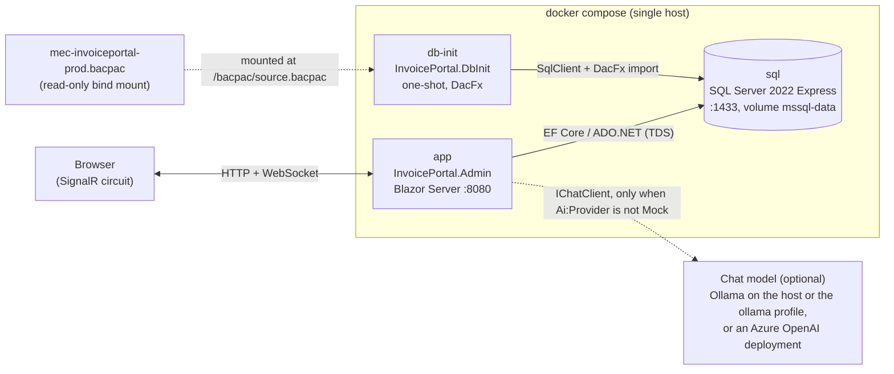
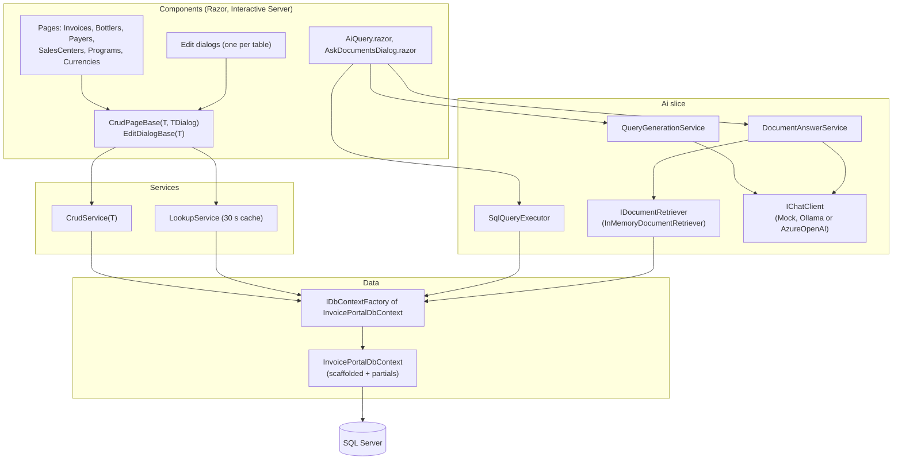
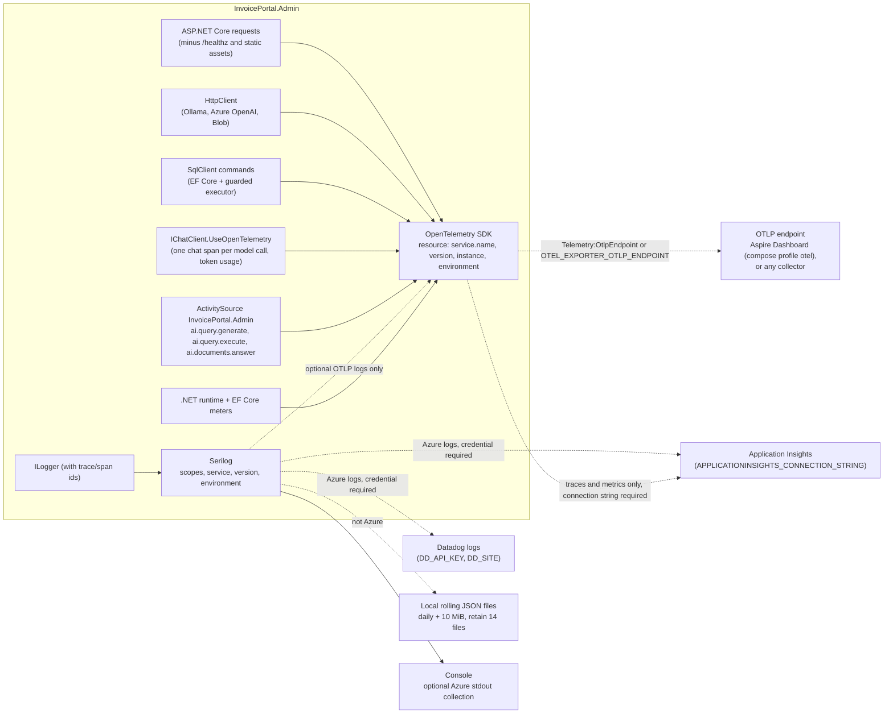
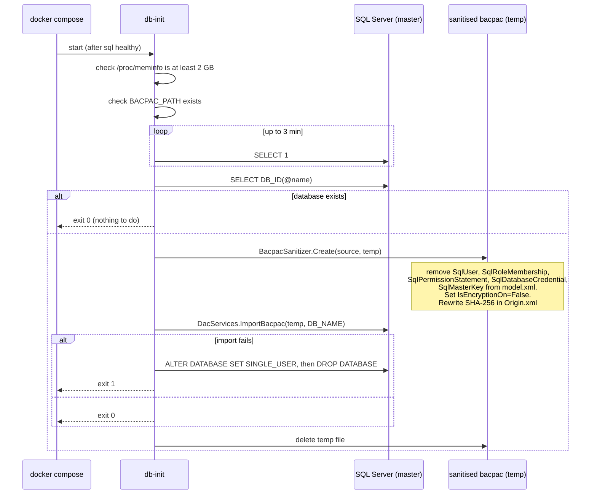
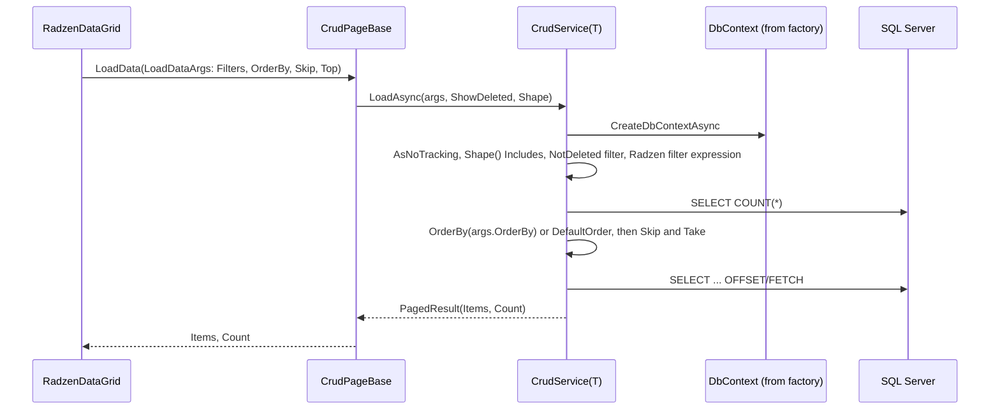
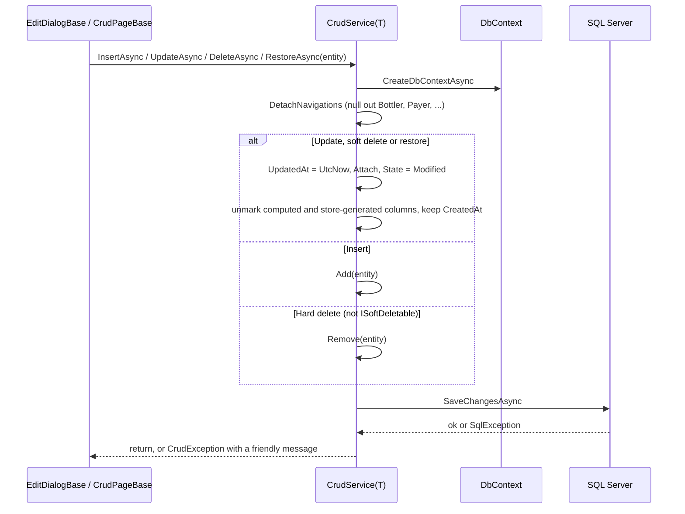
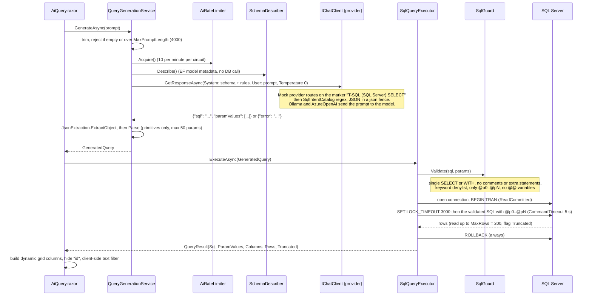
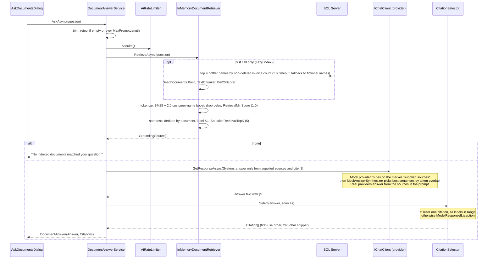

# Invoice Portal Admin: Architecture

This document describes the structure, data flows and integration points of the Invoice Portal Admin
proof of concept. It complements [README.md](README.md), which covers how to run the solution.

The diagrams are Mermaid. If your Markdown viewer does not draw them, open
[docs/ARCHITECTURE.html](docs/ARCHITECTURE.html) in a browser: it is the same content with the diagrams
rendered (needs network access once to load mermaid.js from a CDN). A PDF is at
[docs/ARCHITECTURE.pdf](docs/ARCHITECTURE.pdf). Both are generated from this file; after editing, rebuild
them with `npm run build:pdf` in the `docs/` folder (see `docs/package.json`).

**One-paragraph summary.** A .NET 10 Blazor Web App (Interactive Server render mode, Radzen components)
administers a local copy of the Invoice Portal database. The database is SQL Server 2022 Express running in
Docker, populated once from a production bacpac by a one-shot console app. All data access goes through an
EF Core scaffolded model behind a `DbContext` factory. Two AI features, natural-language-to-SQL and grounded
document Q&A, are built on the `Microsoft.Extensions.AI` abstractions. The chat model is pluggable: the default
`Mock` provider is an in-process fake that needs no network, `Ollama` talks to a local model, and `AzureOpenAI`
talks to an Azure OpenAI deployment with Entra ID credentials. The document index is always in-process. An
`azd` template under `infra/` can host the container in Azure Container Apps against the existing Azure SQL
database. With the defaults, nothing leaves the machine.

---

## 1. System context



Compose start-up ordering is enforced with health conditions: `db-init` waits for `sql` to pass its
`sqlcmd` health check, and `app` waits for `db-init` to exit successfully.

| Service   | Image / build                              | Role                                                             |
|-----------|--------------------------------------------|------------------------------------------------------------------|
| `sql`     | `mcr.microsoft.com/mssql/server:2022-latest`, `MSSQL_PID=Express` | Database engine. Data persists in the `mssql-data` volume. |
| `db-init` | `InvoicePortal.DbInit/Dockerfile`          | Sanitises and imports the bacpac if the database does not exist. |
| `app`     | `InvoicePortal.Admin/Dockerfile`           | The admin UI. HTTP only, port 8080. Exposes `/healthz`.          |
| `ollama`  | `ollama/ollama:latest`, profile `ollama` only | Optional CPU-only local model. Started with `--profile ollama`; data in the `ollama-data` volume. |
| `aspire-dashboard` | `mcr.microsoft.com/dotnet/aspire-dashboard:latest`, profile `otel` only | Optional in-memory OTLP sink with a UI on 18888 (see 3.4). Started with `--profile otel`. |

Locally there is no authentication or authorization layer in the app. It is intended for a single developer
on a local machine. The Azure deployment (section 8) can put Entra ID sign-in in front of the container with
Easy Auth, without application code changes.

---

## 2. Solution structure

```
InvoicePortal.slnx
├── InvoicePortal.DbInit/          console app: bacpac sanitiser + DacFx importer
├── InvoicePortal.Admin/           Blazor Web App
│   ├── Program.cs                 composition root (EntryPoint.Main)
│   ├── Components/                Razor UI: Layout, Pages (Invoices, Lookups, Ai), Shared bases
│   ├── Services/                  CrudService<T>, LookupService, EnumDisplay
│   ├── Logging/                   Serilog routing, validated settings, Application Insights correlation
│   ├── Data/                      EF Core scaffold (never hand-edited) + Partials + Enums + Abstractions
│   ├── Ai/                        AI slice: options, DI, Chat (mock + transport wrapper), Query (NL->SQL), Documents (RAG)
│   └── Telemetry/                 OpenTelemetry options, provider/exporter wiring, the app's ActivitySource and Meter
├── InvoicePortal.Admin.Tests/     xUnit tests for AI, telemetry and logging, no database required
├── docs/                          this document's rendered copy + build script, Azure deployment guide
├── infra/                         Bicep for the Azure deployment (Container Apps, ACR, identity, Blob, App Insights, Azure OpenAI)
├── azure.yaml                     Azure Developer CLI (azd) service definition
└── .github/workflows/             ci.yml (build, test, Bicep validation) and azure-dev.yml (azd provision + deploy)
```

Key packages:

| Package                              | Version  | Used for                                             |
|--------------------------------------|----------|------------------------------------------------------|
| `Microsoft.EntityFrameworkCore.SqlServer` | 10.0.12 | Data access                                     |
| `Radzen.Blazor`                      | 11.4.0   | Grids, dialogs, forms, notifications                 |
| `Microsoft.Extensions.AI` (+ Abstractions) | 10.10.0 | `IChatClient` seam, pipeline builder, logging decorator |
| `OllamaSharp`                        | 5.4.30   | `IChatClient` for a local Ollama server (`Ollama` provider) |
| `Azure.AI.OpenAI`, `Microsoft.Extensions.AI.OpenAI` | 2.1.0, 10.10.0 | `IChatClient` for Azure OpenAI (`AzureOpenAI` provider) |
| `Azure.Identity`                     | 1.21.0   | `DefaultAzureCredential` for Azure OpenAI and Blob Storage |
| `Azure.Extensions.AspNetCore.DataProtection.Blobs` | 1.5.4 | Data Protection key ring in Blob Storage when hosted in Azure |
| `OpenTelemetry.Extensions.Hosting` + `Instrumentation.AspNetCore`, `.Http`, `.SqlClient`, `.Runtime` | 1.18.0 | Traces, metrics and logs (section 3.4) |
| `OpenTelemetry.Exporter.OpenTelemetryProtocol` | 1.18.0 | OTLP export to the Aspire Dashboard or any collector |
| `Azure.Monitor.OpenTelemetry.Exporter` | 1.9.0  | Application Insights traces and metrics (not logs) |
| `Serilog.AspNetCore` | 10.0.0 | Unified ILogger pipeline, console, bootstrap and shutdown |
| `Serilog.Sinks.File` | 7.0.0 | Local daily/size-rolled JSON logs with retention |
| `Serilog.Sinks.ApplicationInsights` | 5.0.1 | Azure application logs, correlated with OpenTelemetry activities |
| `Serilog.Sinks.Datadog.Logs` | 0.6.1 | Azure logs to Datadog over HTTPS, bounded asynchronous queue |
| `Microsoft.SqlServer.DacFx`          | 170.5.76 | Bacpac import (DbInit only)                          |

---

## 3. Runtime architecture of the admin app

### 3.1 Layers



### 3.2 Dependency injection and lifetimes

Blazor Server keeps one DI scope per SignalR circuit, so "scoped" here means "per browser session".

| Registration                                   | Lifetime  | Notes                                                                                 |
|------------------------------------------------|-----------|---------------------------------------------------------------------------------------|
| `IDbContextFactory<InvoicePortalDbContext>`    | Singleton factory | Contexts are created per operation and disposed immediately. `EnableRetryOnFailure(3)`. |
| `CrudService<T>` (open generic)                | Scoped    | One per entity type per circuit.                                                      |
| `LookupService`                                | Scoped    | Dropdown sources cached per circuit for 30 seconds.                                   |
| `IChatClient`                                  | Singleton | Provider-dependent pipeline chosen by `Ai:Provider` (see 7.2). Always ends in `.UseOpenTelemetry()` then `.UseLogging()`. |
| OpenTelemetry providers                        | Singleton | `AddOpenTelemetry()` with tracing, metrics and logging (see 3.4). Skipped entirely when `Telemetry:Enabled` is false. |
| Serilog logger, `AppLoggingOptions` | Singleton | Logging is configured before telemetry. Clears default logging providers and forwards once to the optional OTLP provider. Independent of `Telemetry:Enabled`. |
| `IDocumentRetriever`                           | Singleton | `InMemoryDocumentRetriever` for every provider. Index built lazily on first use.     |
| Health checks                                  | n/a       | `AddHealthChecks()` mapped at `/healthz` for container probes.                        |
| Data Protection                                | Singleton | Only when `DataProtection:BlobUri` is set: key ring persisted to Blob Storage with `DefaultAzureCredential`, so antiforgery tokens survive container restarts. Locally the default file store is used. |
| `SchemaDescriber`                              | Singleton | Schema text derived from EF model metadata, cached.                                   |
| `AiRateLimiter`                                | Scoped    | Fixed window, default 10 requests per minute per circuit.                             |
| `IQueryGenerationService`, `ISqlQueryExecutor`, `IDocumentAnswerService` | Scoped | Stateless orchestration.                          |
| Radzen `DialogService`, `NotificationService`  | Scoped    | Via `AddRadzenComponents()`.                                                          |

A factory is used instead of a scoped `DbContext` because a circuit can live for hours. A long-lived
tracked context would accumulate state and hold a connection open.

### 3.3 Shared CRUD behaviour

Every grid page inherits `CrudPageBase<TEntity, TDialog>` and every edit dialog inherits
`EditDialogBase<TEntity>`. Pages supply only the Radzen markup and a few overrides (`EntityName`, `KeyOf`,
`Shape` for `Include`s, `DialogWidth`). The bases provide server-side `LoadData`, Add/Edit through a
dialog, Delete with confirmation, Restore, the "Show deleted" toggle, and notifications.

### 3.4 Observability (Serilog and OpenTelemetry)

`Logging/LoggingExtensions.cs` makes Serilog the sole application logging pipeline. Local hosts (including
Docker Production) write console and daily/size-rolled JSON files. Azure hosts write console plus Application
Insights and Datadog when their credentials are supplied, without local files. `EntryPoint.Main` uses a
console bootstrap logger and flushes on exit. `Telemetry/TelemetryExtensions.cs` keeps OpenTelemetry traces
and metrics, plus optional OTLP logs forwarded by Serilog for Aspire. OpenTelemetry can be disabled independently.



| Signal  | Sources                                                                                                          |
|---------|------------------------------------------------------------------------------------------------------------------|
| Traces  | ASP.NET Core (filtered by `TelemetryExtensions.IsNoiseRequest`), HttpClient, SqlClient, `InvoicePortal.Admin.Ai` (the `Microsoft.Extensions.AI` decorator, GenAI semantic conventions), `InvoicePortal.Admin` (own spans), plus the spans .NET 10 Blazor emits itself (`Event onclick -> ...`, `Route ...`, `Circuit ...`). Head sampling `Telemetry:TraceSamplingRatio`, parent-based. `NoiseFilteringProcessor` un-records the per-hub-call plumbing spans (`ComponentHub/OnRenderCompleted`, `EndInvokeJSFromDotNet`, ...) that would otherwise produce dozens of one-span traces per click; it is a processor, not a sampler, because SignalR names the span only after it starts. |
| Metrics | ASP.NET Core and Kestrel, HttpClient, .NET runtime, `Microsoft.EntityFrameworkCore`, chat token usage and duration, `invoiceportal.ai.requests` (by `ai.feature` and `ai.outcome`), `invoiceportal.ai.query.rows`. |
| Logs    | `ILogger` and direct Serilog messages, filtered by Serilog levels, with scopes and captured Activity IDs. Console stays on by default. Application Insights uses the captured trace/span IDs and matching role name for correlation. |

OpenTelemetry exporters: OTLP (gRPC by default, `http/protobuf` optional) and Azure Monitor traces/metrics,
each added only when its endpoint/connection string is present. Serilog is the only Application Insights
log exporter: the former Azure Monitor log exporter is removed. `Telemetry:OtlpLogsEnabled=false` disables
just OTLP logs when a collector would duplicate direct sinks. `writeToProviders` preserves Aspire logging
without another console provider. The existing Bicep supplies the Application Insights connection string;
Datadog secret/site configuration is an operator prerequisite, not provisioned by the current template.
The standalone Aspire Dashboard is an in-memory OTLP sink on <http://localhost:18888>. The local `http-otel`
launch profile sends to port 18889; no database initialization is needed for logging changes.

> **Redundancy warning.** Azure stdout collection may store the same logs again in Log Analytics or forward
> them to Datadog. Choose one collection path or disable `AppLogging:ConsoleEnabled`. Do not add another
> Application Insights logging provider or auto-instrumentation agent. Exceptions can legitimately exist
> as both span events and exception logs. Trace sampling does not sample Serilog logs. Datadog receives
> logs only, not APM traces; linking to APM needs compatible trace ingestion and field mapping. Startup
> warns about missing credentials, Azure console collection and simultaneous OTLP log export.

Two privacy switches default to off because the database is a copy of production: `Telemetry:RecordSqlText`
(statement text on database spans) and `Telemetry:RecordAiContent` (prompts and completions on chat spans).
Span attributes otherwise carry only counts and lengths: prompt length, parameter count, row count, truncation,
source and citation counts.

These switches do not redact log messages. EF Database.Command logs (including failed-command SQL) default
to a Serilog `Fatal` threshold so statement text is not copied into files or cloud logs. Other EF/circuit
errors remain visible. General exception messages and explicit application properties can still contain
sensitive data; do not log credentials, invoice content or prompts. No additional Serilog request-logging
middleware is installed because the existing request traces already record timings.

The instrumentation calls in the AI services are `ActivitySource.StartActivity` and counter increments; when no
listener is attached they return null and do nothing, which is also why the unit tests need no telemetry setup.

A typical trace for one AI query, as shown by the Aspire Dashboard:

```
Event onclick -> Radzen.Blazor.RadzenButton.OnClick     (Blazor, the user's click)
├── ai.query.generate                                    (own span: prompt length, parameter count, model error flag)
│   └── chat                                             (Microsoft.Extensions.AI: model id, token usage)
└── ai.query.execute                                     (own span: row count, truncated)
    └── SELECT Invoices Payers                           (SqlClient: db.query.summary, no statement text)
```

The hub call that delivered the click is not the parent: Blazor dispatches the event handler after the hub method
returns, so the `Event` span is a trace root of its own, and the SignalR hub-method spans are dropped by the processor.

---

## 4. Data model

The EF Core model is scaffolded from the local database and never edited by hand (the re-scaffold command
is in the README). Anything that must survive a re-scaffold lives in partial classes.

**Tables in the model** (nine of the many in the database):

| Table                    | Role in the UI                  | Soft delete | Audit columns |
|--------------------------|---------------------------------|-------------|---------------|
| `Invoices`               | Full CRUD, tabbed dialog        | `IsDeleted` (bit)          | yes |
| `Bottlers`               | CRUD (SAP-sourced ids)          | no          | yes |
| `Payers`                 | CRUD (SAP-sourced ids)          | no          | yes |
| `SalesCenters`           | CRUD (SAP-sourced ids)          | no          | yes |
| `Programs`               | CRUD                            | `IsDeleted` (nullable bit) | yes |
| `Currencies`             | CRUD                            | no          | yes |
| `Companies`, `Countries`, `BrandSegmentCategories` | Dropdown sources only | no | yes |

**Domain hierarchy**: Bottler (the "customer") owns Payers; Payer owns Sales Centers; Programs belong to a
Bottler. An Invoice references all of these plus Currency, Company and Country, and may point at a previous
revision of itself (`RevisedInvoiceId`). `Invoices.UserId` is a required foreign key to `AspNetUsers`, a
table this app does not manage. New invoices therefore default to the submitter of a recent invoice.

**Partial-class pattern.** `Data/Entities/Partials/*.cs` add `[NotMapped]` members to scaffolded entities:

- Marker interfaces `ISoftDeletable` and `IAuditable` (in `Data/Abstractions`) so `CrudService<T>` can
  treat soft delete and `UpdatedAt` stamping generically.
- Typed enum views over `int` columns, for example `Invoice.Status` over `Invoice.InvoiceStatus`, using enums
  copied from the Invoice Portal backend (`Data/Enums`).
- `DisplayName` helpers for dialogs and confirmations.

`SoftDelete.NotDeleted<T>()` builds the filter expression against the real mapped `IsDeleted` column
(handling both `bit` and nullable `bit`) so EF can translate it to SQL.

---

## 5. Data flows

### 5.1 Database provisioning (db-init, runs once)



The original bacpac is never modified. Azure SQL bacpacs contain Entra ID users, a master key, a scoped
credential and the TDE flag, none of which an on-premises SQL Server can create, so the sanitiser strips
them from `model.xml` and recomputes the checksum DacFx verifies.

### 5.2 Grid load (server-side paging, sorting, filtering)



Radzen's `LoadDataArgs` carries the grid state. Filtering uses Radzen's expression-based
`QueryableExtension` (no Dynamic LINQ), so everything is translated to SQL. The Invoices page adds an
`Include` for Bottler, Payer, Sales Center and Currency and an optional type filter inside `Shape`.

### 5.3 Create, update, delete, restore



`DetachNavigations` matters because grid rows arrive with navigation objects loaded; attaching them would
make EF try to track or insert the related lookup rows. SQL error numbers 2601/2627 (unique), 547
(foreign key) and 515 (not null) are translated into user-readable messages.

The edit dialog itself loads the entity by key on open, seeds defaults through `CreateNew()`, loads
dropdowns through `OnModelLoadedAsync()`, and runs `ValidateAsync()` (for example, duplicate SAP id checks)
before saving. Cascading dropdowns (Bottler → Payers → Sales Centers, Bottler → Programs) are reloaded
from `LookupService` as the parent selection changes.

### 5.4 Lookup cache

`LookupService` runs small projection queries (`Id + " - " + Name`) against the lookup tables and caches
each result per circuit for 30 seconds, keyed by query name and parent id. `Invalidate()` clears the
cache. It also reads the 50 most recent distinct invoice submitters to satisfy the `UserId` constraint.

### 5.5 AI Insights: natural language to SQL



The prompt, JSON contract parsing, guard, and execution are the same for every provider. With `Mock` the
model is fake, and it deliberately wraps its JSON in a code fence so the real extraction path is exercised.
With `Ollama` or `AzureOpenAI` free-form questions work, and SQL the guard rejects is shown as an error
rather than executed.

### 5.6 Ask the documents: grounded Q&A with citations



Entry points: the header button in `MainLayout` (opens with the retriever's default question) and the
per-row button on the Bottlers page (pre-fills "What do the documents say about {bottler}?").

---

## 6. Database integration points

All app-side access uses one connection string, `ConnectionStrings:InvoicePortal`, supplied as an
environment variable in compose and from `appsettings.Development.json` for host-side runs. The login is
`sa` with `Encrypt=True;TrustServerCertificate=True`.

| Component                      | Mechanism                                        | What it does                                                           |
|--------------------------------|--------------------------------------------------|------------------------------------------------------------------------|
| `InvoicePortal.DbInit`         | `Microsoft.Data.SqlClient` to `master`; DacFx    | Readiness poll, `DB_ID` existence check, `ImportBacpac`, drop on failure. Reads `SQL_SERVER`, `SQL_PORT`, `DB_NAME`, `MSSQL_SA_PASSWORD`, `BACPAC_PATH`. |
| `CrudService<T>`               | EF Core via `IDbContextFactory`                  | Paged list, find, exists, count, insert, update, soft/hard delete, restore. `AsNoTracking` for reads. |
| `LookupService`                | EF Core via factory                              | Projection queries for dropdowns, cached 30 s per circuit.             |
| `InMemoryDocumentRetriever`    | EF Core via factory, once                        | Loads four bottler names to fill document placeholders.                |
| `SqlQueryExecutor`             | ADO.NET on the EF connection (`GetDbConnection`) | Runs guarded, parameterised, model-generated SELECTs inside a transaction that is always rolled back. |
| `SchemaDescriber`              | EF model metadata only                           | No connection. Builds the schema block of the NL-to-SQL prompt from `IModel`. |

Resilience and safety settings:

- `EnableRetryOnFailure(3)` on the EF provider for transient errors.
- Generated SQL: 5 s command timeout, `SET LOCK_TIMEOUT 3000`, 200-row cap, `ReadCommitted` transaction
  rolled back in `finally`. SQL Server has no engine-level read-only transaction, so protection is
  guard-based. For anything beyond a local POC the executor should use a separate `db_datareader` login.
- Column types returned by the executor are wrapped as `Nullable<T>` so null cells do not break Radzen's
  dynamic sort expressions.

---

## 7. AI service integration points

The AI slice is designed around two seams. Everything else (prompts, parsing, guards, citation
validation, rate limiting, UI) is provider-agnostic.

### 7.1 The two seams

| Seam                 | Interface                          | Implementations                                   |
|----------------------|------------------------------------|---------------------------------------------------|
| Chat model           | `Microsoft.Extensions.AI.IChatClient` | `MockChatClient` (in-process), OllamaSharp's `OllamaApiClient` (local model), Azure OpenAI's chat client via `.AsIChatClient()` |
| Document retrieval   | `Ai/Documents/IDocumentRetriever`  | `InMemoryDocumentRetriever` only. A real knowledge base (Azure AI Search / Foundry IQ) would be a second implementation. |

Registration lives in `Ai/AiServiceCollectionExtensions.cs` and switches on `Ai:Provider`. `AiOptions`
validates the value at start-up against the three registered names, so a typo fails fast rather than
silently falling back to the mock.

### 7.2 Chat providers

| Provider      | Client and pipeline                                                                                   | Network                                   | Credentials                       |
|---------------|-------------------------------------------------------------------------------------------------------|-------------------------------------------|-----------------------------------|
| `Mock`        | `MockChatClient` → `UseLogging`                                                                        | None                                      | None                              |
| `Ollama`      | `OllamaApiClient(HttpClient, model)` → `ModelTransportChatClient` → `ConfigureOptions(num_ctx)` → `UseLogging` | `Ai:Ollama:Endpoint` (host GPU install or the `ollama` compose service) | None                              |
| `AzureOpenAI` | `AzureOpenAIClient(endpoint, DefaultAzureCredential).GetChatClient(deployment).AsIChatClient()` → `ModelTransportChatClient` → `UseLogging` | `Ai:AzureOpenAI:Endpoint` | Entra ID token: managed identity in Azure, `az login` on a laptop. The resource has local keys disabled. |

`ModelTransportChatClient` is a `DelegatingChatClient` that converts transport failures into
`ModelResponseException` with an actionable message: endpoint unreachable, model not pulled, HTTP 401/403/404/429
from Azure OpenAI, or a timeout. The pages already catch `AiException`, so a misconfigured provider shows a
readable error rather than a generic one. The Ollama pipeline also sets `num_ctx` from `Ai:Ollama:ContextLength`
because Ollama's default context window is too small for the schema prompt plus a reply.

### 7.3 How the mock decides what to do

`MockChatClient` inspects the system prompt for a marker string:

- `"T-SQL (SQL Server) SELECT"` (from `QueryGenerationService.SystemPromptMarker`) → `SqlIntentCatalog`,
  a first-match-wins table of about a dozen regex intents that produce parameterised T-SQL in the exact
  JSON shape the real prompt demands. Unmatched prompts return `{"error": ...}`.
- `"supplied sources"` (from `DocumentAnswerService.SystemPromptMarker`) → `MockAnswerSynthesizer`, which
  parses the sources JSON out of the user message and stitches the most relevant sentences, citing `[S#]`.

A real model never sees these markers as anything special; it simply follows the instructions.

### 7.4 Prompt contracts (provider-independent)

**NL-to-SQL.** System prompt = schema block from `SchemaDescriber` + domain notes (soft-delete filters,
hierarchy, status codes, bracketed `[From]`/`[To]` columns) + rules. Required reply:
`{"sql": "<T-SQL>", "paramValues": [<primitives>]}` or `{"error": "<why>"}`. Parsed by `JsonExtraction`
(tolerates fences and prose) and `QueryGenerationService.Parse` (primitives only, at most 50 parameters).

**Grounded Q&A.** System prompt instructs the model to answer only from the supplied sources, treat source
text as data rather than instructions, and cite every statement with `[S#]`. User message =
`Question: ...` followed by `Sources (JSON):` and an array of `{Label, Title, CustomerName, SourcePath,
Content}`. `CitationSelector` rejects answers with no citation or an out-of-range label.

### 7.5 Configuration

Bound from the `Ai` section (`appsettings.json`), overridable with `Ai__*` environment variables.

| Key                        | Default                    | Effect                                                                    |
|----------------------------|----------------------------|---------------------------------------------------------------------------|
| `Enabled`                  | `true`                     | Hides the AI Insights nav item, the header button and the per-row button; `/ai/query` shows a warning. |
| `DocumentChatEnabled`      | `true`                     | Gates the "Ask the documents" dialog only.                                 |
| `Provider`                 | `Mock`                     | `Mock`, `Ollama` or `AzureOpenAI`. Anything else fails validation at start-up. |
| `Ollama:Endpoint`          | `http://localhost:11434`   | Ollama base URL. Compose overrides it to `http://host.docker.internal:11434`. |
| `Ollama:Model`             | `qwen2.5-coder:7b`         | Model tag. Must already be pulled.                                         |
| `Ollama:TimeoutSeconds`    | 120                        | Per-call HTTP timeout. CPU inference can take tens of seconds.             |
| `Ollama:ContextLength`     | 8192                       | Sent as `num_ctx`. The schema prompt needs more than Ollama's default.     |
| `AzureOpenAI:Endpoint`     | empty                      | Required when the provider is `AzureOpenAI`. Set by the Bicep template in Azure. |
| `AzureOpenAI:Deployment`   | `gpt-4.1-mini`             | Deployment name on the resource.                                           |
| `MaxPromptLength`          | 4000                       | Prompt / question length cap.                                              |
| `RateLimitPerMinute`       | 10                         | Fixed window per circuit, shared by both AI features.                      |
| `MaxRows`                  | 200                        | Row cap on generated SQL results.                                          |
| `CommandTimeoutSeconds`    | 5                          | Command timeout for generated SQL.                                         |
| `RetrievalTopK`            | 5                          | Maximum grounding sources after dedupe.                                    |
| `RetrievalMinScore`        | 1.0                        | BM25 threshold, analogue of a reranker threshold.                          |

### 7.6 Adding another provider

1. Add the provider's `IChatClient` package.
2. Add a `case` in `AddInvoicePortalAi` that calls `AddChatClient(...)`, wraps it in
   `ModelTransportChatClient` so transport errors stay readable, and keeps `.UseLogging()`.
3. Add the name to the `Provider` regular expression in `AiOptions` and to `AiOptionsTests`.
4. Optionally register a real `IDocumentRetriever` that calls a knowledge base and maps hits to
   `GroundingSource` (deduplicated, labelled `S1..Sn`).

Nothing in the pages, services, guards or the rest of the tests needs to change. Any non-mock provider sends
the schema (NL-to-SQL) and document content (Q&A) to the model endpoint, so review where that endpoint is
before enabling it outside the local machine.

---

## 8. Configuration and environments

| Setting                             | Compose (`app`)                                   | Host-side development                          |
|-------------------------------------|---------------------------------------------------|------------------------------------------------|
| `ASPNETCORE_ENVIRONMENT`            | `Production`                                      | `Development` (launch profile `http`)          |
| `ConnectionStrings__InvoicePortal`  | env var, `Server=sql,1433`                        | `appsettings.Development.json`, `localhost,1433` |
| HTTP port                           | 8080                                              | 5098 (`.claude/launch.json`, profile `http`)   |
| `Ai__Enabled`, `Ai__DocumentChatEnabled` | env vars in `docker-compose.yml`              | `appsettings.json` defaults                     |
| `Ai__Provider`, `Ai__Ollama__Endpoint`, `Ai__Ollama__Model` | from `.env` (`AI_PROVIDER`, `AI_OLLAMA_ENDPOINT`, `AI_OLLAMA_MODEL`) with Mock / host Ollama defaults | `appsettings.json` defaults, or `Ai__Provider` set in the shell |
| SQL SA password, DB name            | `.env` (`MSSQL_SA_PASSWORD`, `DB_NAME`), read by compose | same password hard-coded in `appsettings.Development.json` |
| `OTEL_EXPORTER_OTLP_ENDPOINT`, `Telemetry__RecordSqlText` | from `.env` (`OTEL_EXPORTER_OTLP_ENDPOINT`, `TELEMETRY_RECORD_SQL_TEXT`), empty / false by default | `Telemetry` section in `appsettings.json`, or `OTEL_EXPORTER_OTLP_ENDPOINT` set in the shell (`http://localhost:18889` for the dashboard) |
| `APPLICATIONINSIGHTS_CONNECTION_STRING` | not set                                       | not set; set by the Bicep template in Azure     |
| `AppLogging__RunningInAzure` | unset, auto-detects as local despite Production | unset, auto-detects as local; override for other Azure hosts |
| `AppLogging__FilePath` | `/app/logs/invoiceportal-.json` by default, mount a writable volume for persistence | `logs/invoiceportal-.json` under content root |
| `AppLogging__FileSizeLimitBytes`, `AppLogging__RetainedFileCountLimit` | 10485760 bytes, 14 files, daily and size rolling | same defaults; not necessarily 14 days |
| `DD_API_KEY`, `DD_SITE` | ignored for local logging | used only in Azure; site defaults to `datadoghq.com`, key must be a secret reference |
| `Telemetry__OtlpLogsEnabled` | true when OTLP configured | true, keeps Aspire structured logs |

Azure detection checks `CONTAINER_APP_NAME`, `WEBSITE_INSTANCE_ID`, or `WEBSITE_SITE_NAME`; neither
`Production` nor cloud credentials imply Azure. For Azure VM/AKS hosting use the explicit override.
`AppLogging__ApplicationInsightsEnabled` and `AppLogging__DatadogEnabled` can disable cloud sinks separately.
`AppLogging__DatadogApiKey` and `AppLogging__DatadogSite` override the standard Datadog keys.
Datadog's supported sites and secure configuration steps are in the README logging section. Use secret/Key
Vault references, never source-controlled keys. Missing credentials disable just that sink with a startup warning.
Optional `DD_SERVICE`, `DD_ENV`, `DD_VERSION` override Datadog tags. Configure levels under `Serilog:MinimumLevel`,
not the former `Logging:LogLevel`. `Serilog:WriteTo`/`Serilog:AuditTo` are rejected at startup so configuration
cannot bypass the environment-based sink selection.

Local log folders are git/Docker/publish-excluded. Custom paths need equivalent exclusions and permissions.
Datadog is batched with a 10,000-event queue; remote delivery is best-effort, not a durable audit trail.
Sink shutdown flushes normally, but force-kills, network failures, queue limits, or container replacement
can lose logs. Local files roll after the threshold is reached, so a single oversized event can exceed it.

**Azure hosting.** `azure.yaml` and `infra/*.bicep` describe an Azure Developer CLI deployment to Container
Apps (one replica, sticky sessions and WebSockets for the Blazor circuit). The template provisions a container
registry, a user-assigned managed identity, a storage account for the Data Protection key ring, Log Analytics
and Application Insights, and optionally an Azure OpenAI resource with a `gpt-4.1-mini` deployment. It does not
create or restore a database: the container is pointed at the existing Azure SQL database, and the managed
identity is granted access with `infra/sql/create-app-user.sql`. The template sets `DataProtection__BlobUri`,
`Ai__Provider=AzureOpenAI` and `Ai__AzureOpenAI__Endpoint` on the container, and can enable Entra ID sign-in
(Easy Auth) when `ENTRA_CLIENT_ID` is supplied. `.github/workflows/azure-dev.yml` runs `azd provision` and
`azd deploy` on pushes to `main` using OIDC; `ci.yml` builds, tests and validates Bicep on pull requests.
Step-by-step instructions are in `docs/azure-deploy.md`.

> **Action item.** The `.env.Development` file in the repo root belongs to a different application (the
> Invoice Portal API). No code in this solution reads it. It contains credentials for external Azure
> resources and should be removed from the working tree or rotated. It is covered by `.gitignore` but
> still present on disk.

`RequiresAspNetWebAssets=true` in the Admin project forces the SDK to restore the framework's Blazor web
assets during the Docker build, which restores from the `.csproj` alone. Without it the published container
returns 404 for `blazor.web.js` and no circuit starts.

---

## 9. Security and safety posture

- **Network**: with the default `Mock` provider there are no outbound calls. `Ollama` talks to a local
  endpoint (host or compose sidecar). `AzureOpenAI` sends prompts, which include the schema and document
  content, to the configured Azure OpenAI endpoint over HTTPS with an Entra ID token. The local listeners
  are the app on 8080, SQL Server on 1433 and, with the profile, Ollama on 11434.
- **Identity**: locally there is no authentication or authorization, and the app uses the `sa` login. In
  Azure, Easy Auth with Entra ID is optional and the app reaches SQL, Blob Storage, the registry and Azure
  OpenAI through a managed identity with no stored keys. `/healthz` is unauthenticated in both cases.
- **Generated SQL**: defence in depth through `SqlGuard` (single SELECT, denylist, parameter naming,
  no comments or system variables), a short command and lock timeout, a row cap and an unconditional
  rollback. The guard is a regex allow/deny list, not a parser, so a dedicated read-only login is the
  recommended next layer.
- **Prompt injection**: the Q&A system prompt tells the model to treat source text as data. Citation
  validation ensures the answer can only reference supplied sources. With a real model this remains a
  mitigation, not a guarantee.
- **Data**: the bacpac is a copy of production data, including user emails. It lives only in the Docker
  volume and the bind-mounted file, both excluded from git.
- **Telemetry/logging**: local defaults write console and rolling files but do not export remotely. OTLP,
  Application Insights and Azure Datadog require configured destinations/credentials. SQL/prompt content is
  excluded from spans unless the telemetry privacy switches are enabled. Log messages and exceptions are
  not automatically redacted; EF SQL-command logs are separately suppressed by default. Restrict file access
  and cloud retention, avoid sensitive properties, and account for third-party Datadog egress.

---

## 10. Testing

`InvoicePortal.Admin.Tests` (xUnit) covers AI, telemetry and logging without a database:

| Test class                          | Covers                                                             |
|-------------------------------------|--------------------------------------------------------------------|
| `SqlGuardTests`                     | Accepts single parameterised SELECT/WITH; rejects DML, DDL, comments, multiple statements, bad parameter names, `@@` variables. |
| `QueryGenerationServiceTests`       | JSON contract parsing, fenced JSON, error objects, parameter limits, length and rate-limit rejections (via `StubChatClient`). |
| `MockChatClientContractTests`       | The mock honours the same output contract a real model is instructed to follow. |
| `InMemoryDocumentRetrieverTests`    | Ranking, customer boost, threshold, dedupe, labelling, TopK, fallback names. |
| `CitationSelectorTests`             | Cited-only selection, ordering, rejection of missing or unknown labels. |
| `AiOptionsTests`                    | Only `Mock`, `Ollama` and `AzureOpenAI` pass validation; Ollama defaults point at a local coder model with a large enough context. |
| `TelemetryOptionsTests`             | Defaults export nothing and record no SQL text or prompt content; OTLP protocol and sampling ratio validation; health probe and static assets are excluded from request tracing. |
| `AppLoggingTests` | Azure detection/override, credential-gated sink selection, trusted Datadog sites, startup warnings, Activity-to-Application Insights correlation, real local file rolling/retention, and once-only OTLP log forwarding with scopes and trace ID. No cloud calls. |

Run with:

```bash
dotnet test InvoicePortal.slnx
```

CRUD pages and services are exercised manually against the container. Logging tests construct an in-process
host with temporary files and an in-memory OpenTelemetry exporter; cloud delivery requires configured
credentials and an environment smoke test, and is not claimed by offline tests.

---

## 11. Known limitations and extension points

- **Scope**: nine tables. The database has many more (users, attachments, workflow, cancellation
  categories, samples purposes) that are visible only as foreign-key ids.
- **`Invoices.UserId`**: satisfied by borrowing a recent submitter because `AspNetUsers` is out of scope.
- **Mock model**: understands only the regex intents in `SqlIntentCatalog`; everything else returns the
  fallback error. Real providers remove that limit but add latency (seconds on a GPU, tens of seconds on
  CPU for Ollama) and, for Azure OpenAI, cost and egress.
- **Document index**: always the six seeded documents, whichever chat provider is active. A real knowledge
  base needs a second `IDocumentRetriever`.
- **Lookup cache**: per circuit, time-based, not invalidated by edits from other sessions.
- **Single replica**: Blazor Server circuits are in-process, so the Azure template runs one replica with
  sticky sessions. Scaling out would need a SignalR backplane.
- **Extension seams**: `IChatClient` (a new `case` in the provider switch), `IDocumentRetriever`,
  `OnModelCreatingPartial` in the context partial, and the `CrudPageBase`/`EditDialogBase` pair for adding
  another table (one grid page, one dialog, one partial class).
